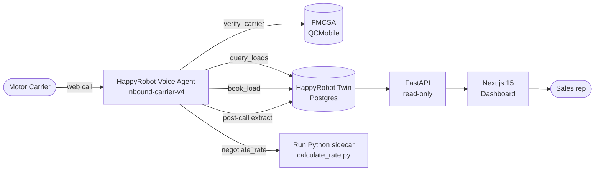

# Robot

> Inbound carrier voice agent for freight brokerages, built on HappyRobot.


---

## What this is

Carriers dial an AI voice agent, get verified against the FMCSA in real time, hear matching loads from the broker's catalog, negotiate the rate up to three rounds, and get booked — all without a human picking up. Every call is captured (transcript, outcome, sentiment, agreed rate, MC, lane) and surfaced on a custom operations dashboard.

The voice agent itself runs on the [HappyRobot](https://happyrobot.ai) platform. This repository contains the supporting backend (FastAPI), the operations dashboard (Next.js 15), the data schemas, the prompts, and the deployment scripting that make the system reproducible end-to-end.

This was built against the HappyRobot FDE technical challenge — full spec at [`docs/FDE-TECHNICAL-CHALLENGE.md`](docs/FDE-TECHNICAL-CHALLENGE.md). The three top-level objectives the build satisfies:

1. An inbound HR voice agent that verifies MC numbers against FMCSA, searches the loads catalog, negotiates up to three rounds, mocks a transfer to a sales rep, then extracts and classifies the call (outcome + sentiment).
2. A custom dashboard for the resulting metrics (no platform analytics).
3. Containerized with Docker, deployed to a public cloud, behind HTTPS, with API-key auth on every `/v1/*` route, and reproducible from a clean clone.

## Live demo

| What | URL | Health |
|---|---|---|
| Dashboard | https://robot-dashboard-andres-morones.fly.dev | `/api/health` |
| API | https://robot-api-andres-morones.fly.dev | `/healthz` |
| HR workflow | https://platform.happyrobot.ai/fdeandresnavarro/workflows/xsfvbpjpsoy4/editor/c8yjoguc8i4t | — |

The dashboard is read-only and safe to share. The API requires a Bearer token on every `/v1/*` route.

## 🏗️ Architecture at a glance



Three independently deployable surfaces:

1. **HappyRobot workflow** — voice agent, prompts, tools, post-call extraction. Lives in HR (not in this repo); reproducible from `docs/iac/ui-build-guide.md`.
2. **FastAPI backend** — Bearer-authed read API over the HR Twin store. Powers the dashboard.
3. **Next.js dashboard** — server-rendered analytics on funnel, economics, operational, quality, and telemetry KPIs.

For a deeper walkthrough of the system (data flow, table layout, security model, decisions), see [`ARCHITECTURE.md`](ARCHITECTURE.md).

## 🚀 Quick start (local)

You need Docker Desktop, a HappyRobot API key, and a chosen Bearer token.

```bash
git clone https://github.com/AndresMorones/Robot.git
cd Robot
cp .env.example .env       # then fill in API_BEARER_TOKEN + HAPPYROBOT_API_KEY
docker compose up --build
```

Then open:

- API:       http://localhost:8000  (Swagger at `/docs`)
- Dashboard: http://localhost:3000

The dashboard talks to the API over the internal Docker network — you do not need to expose anything beyond the two ports above.

### Required environment variables

| Variable | Required | Purpose |
|---|:---:|---|
| `API_BEARER_TOKEN` | yes | Shared secret between API and dashboard. Generate with `openssl rand -hex 32`. |
| `HAPPYROBOT_API_KEY` | yes | HR org API key (`sk_live_...`). API uses this server-side to read Twin. Never reaches the browser. |
| `FMCSA_WEB_KEY` | no | Reserved for a future server-side FMCSA proxy. The HR `verify_carrier` tool calls FMCSA directly today. |
| `API_BASE_URL` | no | Where the dashboard fetches from. Defaults to the in-network `http://api:8000`. |
| `LOG_LEVEL` | no | structlog filter level. Defaults to `INFO`. |

A per-service template with longer prose lives at `dashboard/.env.example`. The API reads its env via `pydantic-settings` from the same root `.env` when running under `docker compose`.

## ☁️ Deploy to your own cloud

The deployed reference targets [Fly.io](https://fly.io) in region `iad` with two apps (one for the API, one for the dashboard) and a one-time `fly secrets set` for each. Step-by-step procedure — including app create, secrets, smoke-test, and HR-side wiring — is in [`DEPLOY.md`](DEPLOY.md).

Always use the wrapper scripts under `scripts/`:

```bash
scripts/deploy-api.sh         # or .ps1 on PowerShell
scripts/deploy-dashboard.sh   # or .ps1 on PowerShell
```

They self-`cd` to the right directory and verify the deployed image's healthcheck fingerprint, so a wrong-cwd `flyctl deploy` cannot silently ship the API image to the dashboard app.

## Project structure

```
.
├── api/             FastAPI backend (Python 3.12, uv, pydantic v2, structlog)
├── dashboard/       Next.js 15 dashboard (App Router, Tailwind 4, shadcn/ui, Recharts)
├── data/            Twin DDL + loads catalog seed
├── docs/            FDE spec + broker-facing build description
├── scripts/         Deploy wrappers + signed-link helper
├── docker-compose.yml
├── fly.toml         API Fly config (dashboard has its own under dashboard/fly.toml)
├── README.md        This file
├── DEPLOY.md        End-to-end Fly.io deployment guide
└── ARCHITECTURE.md  Stack, data model, security, decisions, roadmap
```

## HappyRobot workflow

The voice agent — prompt, tools, negotiation sidecar, AI Extract, write-back to Twin — is configured inside HappyRobot and is not part of this repository (per FDE Deliverable 5: link, not source). The active workflow is `inbound-carrier-v4`.

- Editor link: https://platform.happyrobot.ai/fdeandresnavarro/workflows/xsfvbpjpsoy4/editor/c8yjoguc8i4t
- Behavior overview, written for a freight broker reading the system cold: [`docs/broker-doc.md`](docs/broker-doc.md)
- Architecture + decision rationale: [`ARCHITECTURE.md`](ARCHITECTURE.md)

The HR side reads from this repo's API (`/v1/loads/...`) for load lookups, and writes back to the HR Twin Postgres store after each call. The API never holds call state itself.

## API endpoints

A subset of the routes the dashboard and HR workflow consume. All `/v1/*` routes require Bearer auth; full schemas at `/docs` (Swagger).

| Method | Path | Purpose |
|---|---|---|
| `GET` | `/healthz` | Fly healthcheck (unauthenticated) |
| `GET` | `/docs` | Swagger UI (unauthenticated) |
| `GET` | `/v1/loads/{load_id}` | Single load lookup — used by HR `query_loads` |
| `GET` | `/v1/loads/search` | Lane / equipment search — used by HR `query_loads` |
| `GET` | `/v1/calls` | Recent calls feed (no transcript) |
| `GET` | `/v1/calls/{call_id}` | Per-call detail with bookings and lane |
| `GET` | `/v1/carriers` | Per-MC rollup feed |
| `GET` | `/v1/carriers/{mc}` | Per-MC drilldown |
| `GET` | `/v1/dashboard/funnel` | Acquisition → quote → book funnel KPIs |
| `GET` | `/v1/dashboard/economics` | Avg loadboard rate, agreed rate, effective delta |
| `GET` | `/v1/dashboard/operational` | Duration, abandon, decline rates |
| `GET` | `/v1/dashboard/quality` | Sentiment, outcome, Case Health Score distributions |

## 🔒 Security

- HTTPS everywhere via Fly.io's managed Let's Encrypt issuer (`force_https = true` in `fly.toml`).
- Every `/v1/*` route requires `Authorization: Bearer <token>` (or `?token=<token>` as a query-string fallback for tool integrations that cannot send custom headers). Constant-time compare in `api/app/deps.py`.
- Secrets live in Fly Secrets in production and in a gitignored `.env` locally. They are never committed.
- The API key never reaches the browser bundle — the dashboard's API client uses Next.js `server-only` imports.

The full security model — threat surface, secret rotation, what is and is not in scope for MVP — is in [`ARCHITECTURE.md`](ARCHITECTURE.md#8-security-model).

## Reproducibility

| Need | Path |
|---|---|
| Loads catalog seed | `data/twin_seed_loads_v2.sql` |
| Loads table DDL | `data/twin_schema_loads.sql` |
| `calls_log` DDL | `data/twin_schema_calls_log.sql` |
| `bookings` DDL | `data/twin_schema_v15_bookings.sql` |
| FMCSA fixture data (offline tests) | `api/tests/fixtures/` |
| End-to-end deploy walkthrough | [`DEPLOY.md`](DEPLOY.md) |
| HR workflow setup | [`DEPLOY.md`](DEPLOY.md) Step 4 |

Anyone with a Fly.io account, a HappyRobot account, and the FMCSA web key from the public QCMobile portal can stand up an equivalent deployment from a clean clone.

## Tech decisions

A few choices worth flagging up front: the operational store is HappyRobot's managed Twin Postgres rather than a self-hosted database (single source of truth), the dashboard skips heavy chart and date-picker libraries in favor of Recharts plus native inputs, and the negotiation state machine lives in an HR Run Python sidecar rather than in this API so prompt injection cannot extract the floor or target rates. The full series of decisions, with rationale and references, is in [`ARCHITECTURE.md`](ARCHITECTURE.md).

## Tests

```bash
cd api
uv sync
uv run pytest
```

Contract-style tests cover the auth boundary, the loads endpoints, dashboard aggregations, the Twin client wrapper, dashboard caching, call/booking response shapes, FMCSA eligibility evaluation, and MC-number normalization. Live end-to-end integration tests against a HR workflow are intentionally out of scope for the public branch — they require recorded webhook fixtures and a private Twin namespace.

To smoke-test the live API:

```bash
curl -H "Authorization: Bearer $API_BEARER_TOKEN" \
  https://robot-api-andres-morones.fly.dev/v1/dashboard/funnel
```

## Roadmap

The shipped scope is intentionally narrow — voice flow, persistence, dashboard, deploy. Larger items deferred behind explicit triggers:

- Multi-region failover and a Postgres replica path that bypasses the Twin REST gateway
- Transcript-review tooling (Langfuse / Phoenix / Logfire) on top of `calls_log.transcript`
- Server-side FMCSA proxy with TTL cache
- Loads-catalog dynamic sync from a broker TMS instead of a bundled CSV
- Credential rotation runbook, app-level rate limits, CSP headers, supply-chain pinning

See [`ARCHITECTURE.md`](ARCHITECTURE.md#12-known-limitations-and-roadmap) and the broker doc for the full list with priorities.

## License

MIT. Use it, fork it, ship it. No warranty.

## Built with

- [HappyRobot](https://happyrobot.ai) — voice platform, Twin Postgres gateway, Run Python sidecar
- [FMCSA QCMobile](https://mobile.fmcsa.dot.gov/qc) — public carrier verification API
- [Fly.io](https://fly.io) — container hosting and managed Let's Encrypt
- [Next.js 15](https://nextjs.org), [Tailwind 4](https://tailwindcss.com), [shadcn/ui](https://ui.shadcn.com), [Recharts](https://recharts.org)
- [FastAPI](https://fastapi.tiangolo.com), [Pydantic v2](https://docs.pydantic.dev), [structlog](https://www.structlog.org), [uv](https://github.com/astral-sh/uv)
