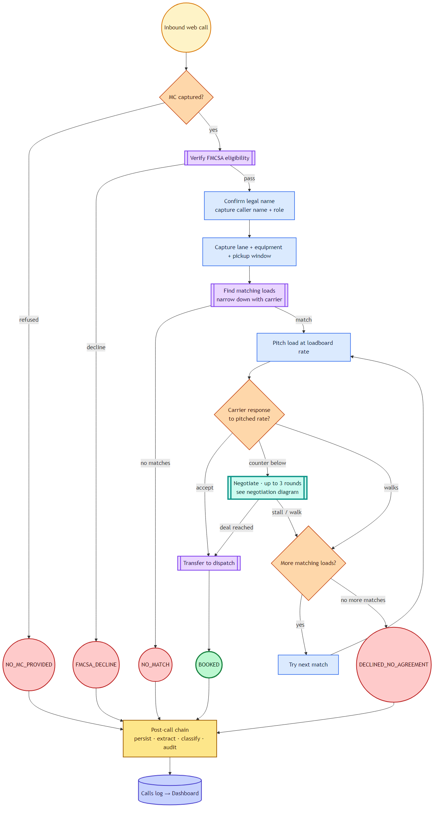
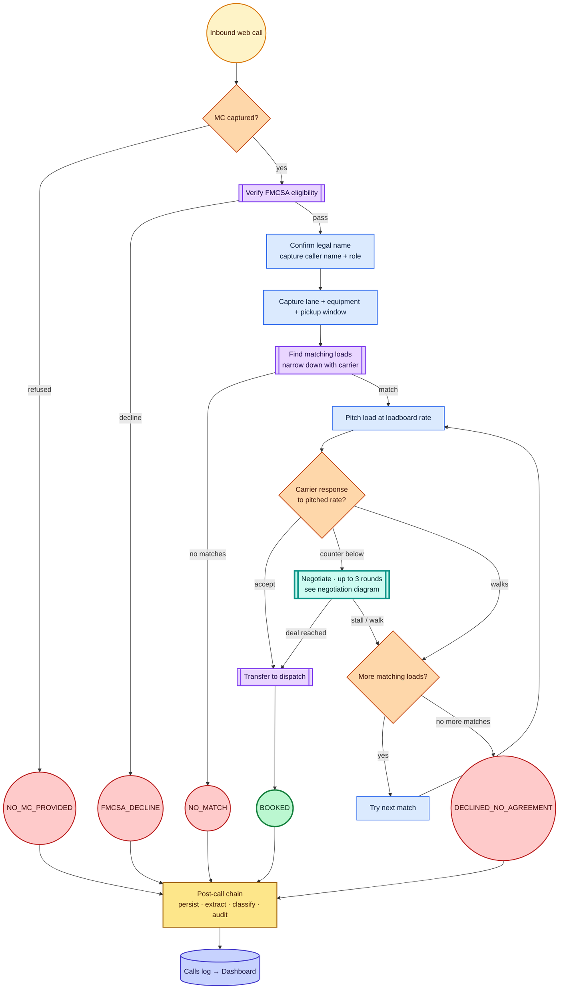
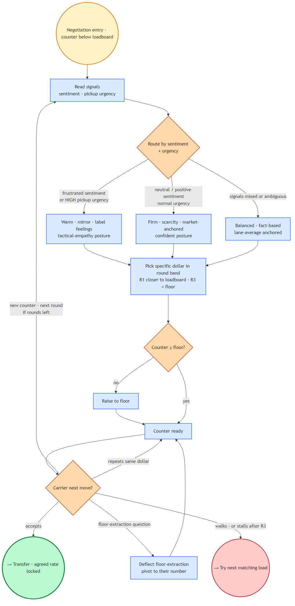
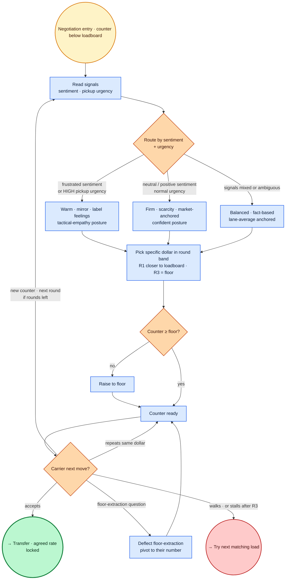

# Inbound Carrier Voice Agent — Logic Tree

> **Generated by** `scripts/build_logic_tree.py` on 2026-04-25T19:46:36+00:00.
> Edit the `.mmd` files in `docs/agent-logic-tree/`, re-run the script.

The agent's complete decision logic in two diagrams:

1. **Core tree** — every key event from inbound call to dashboard write.
   FMCSA collapses to one node; the negotiation node is a drill-down marker.
2. **Negotiation drill-down** — the 3-persona, 3-round loop with floor guard
   and anti-renegotiation rule. Referenced from the core tree's `Negotiate` node.

**Visual conventions** (consistent across both diagrams):

| Color | Meaning |
|---|---|
| Amber rounded | Entry / start |
| Blue rectangle | Agent action |
| Peach diamond | Decision branch |
| Purple double-rect | Tool call (verify_carrier, search_loads_by_lane, Transfer Popup) |
| Teal thick-border | Sub-process reference (drill into another diagram) |
| Pink rounded | Negotiation persona (sub-tree only) |
| Green circle | Success terminal (BOOKED) |
| Red circle | Decline terminal (tagged outcome) |
| Gold rectangle | Post-call automated chain |
| Indigo cylinder | Data store (Twin Postgres → Dashboard) |
| Gray dashed | Side annotation (guardrails / tool retries / eager parallel) |

---

## Workflow tree

Mermaid source — click to expand

_Source: [`core.mmd`](agent-logic-tree/core.mmd)_

---

## Negotiation drill-down

Mermaid source — click to expand

_Source: [`negotiation.mmd`](agent-logic-tree/negotiation.mmd)_

---
