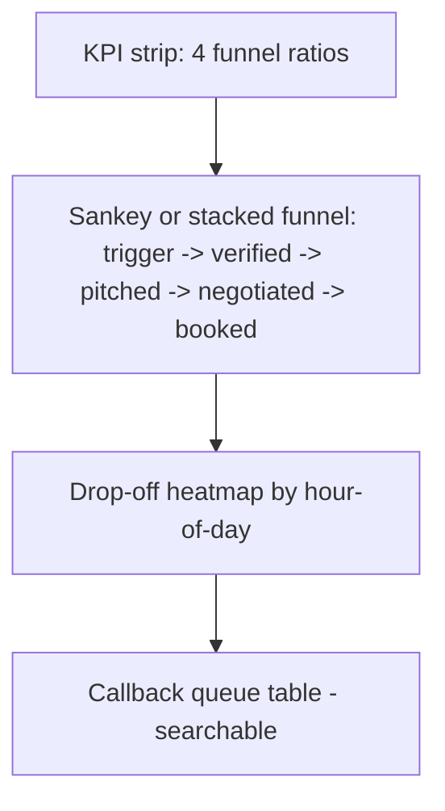
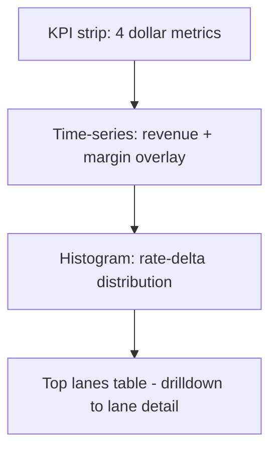
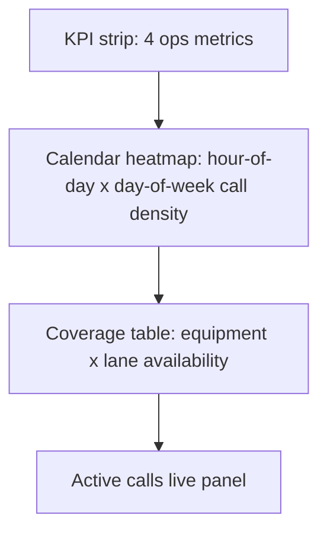
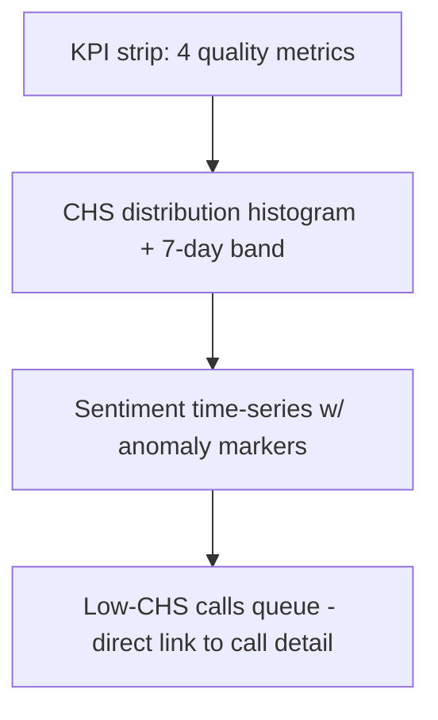
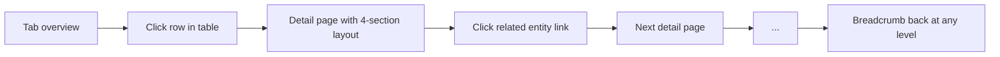
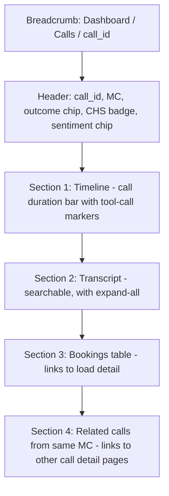
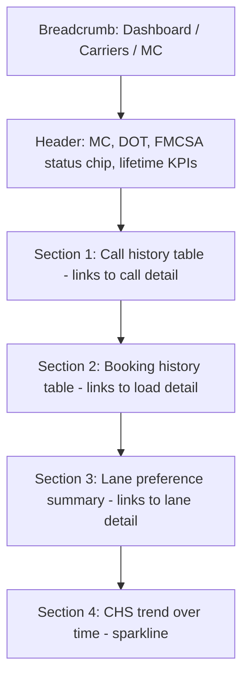
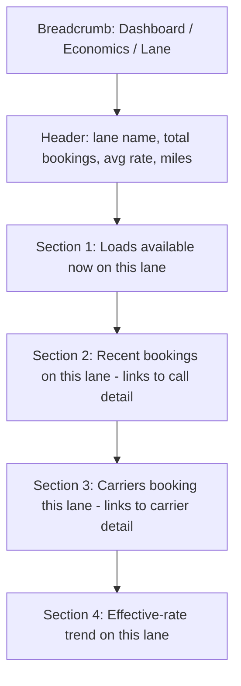

# Dashboard v2 — UX / Information Architecture Proposal

**Audience:** Andres + parent synthesis agent.
**Scope:** Structural recommendation only. No code, no metric selection, no chart library decisions. Agents 1, 3, 4 own those layers.
**Anchors:** `project_dashboard_v2_requirements.md` (8 locked answers), existing dashboard at `dashboard/src/app/dashboard/`, ADR-007 caching, ADR-009 freshness.

This document proposes the room layout. Agent 1 picks the furniture (metrics), Agent 3 picks the upholstery (charts), Agent 4 confirms the wiring (SQL + active-call). I am laying down walls, doors, and the path users walk through them.

---

## 1. Tab structure

The existing 4-tab structure (Funnel / Economics / Operational / Quality) is engineering-shaped, not persona-shaped. Each tab dumps a category of stats; no tab answers a question a specific person asks at a specific moment. Production-grade dashboards are the inverse: each tab is one persona's morning ritual.

I propose **5 tabs** plus a persistent **Calls** and **Carriers** index in the side nav (these are reference indexes, not analytical surfaces — they remain as-is).

### Tab 1 — **Pulse** (default landing)

- **Persona:** Broker owner (Carlos / sales lead glance)
- **Decision in 10s:** "Is the agent earning its keep today vs. yesterday vs. plan?"
- **Top 5 metrics (placeholders for Agent 1):** Bookings today w/ delta, Effective rate vs. loadboard delta time-series, Booking rate trend, Active calls right now, CHS rolling avg
- **Layout:**

```mermaid
flowchart TB
  A[Header: date filter + Acme logo + active-call pulse] --> B
  B[KPI strip: 4 hero KPIs w/ vs-yesterday + vs-target]
  B --> C[Hero chart: effective rate delta over time]
  C --> D[Two-up: bookings sparkline | sentiment trend]
  D --> E[Last 5 calls live tile - links to Calls tab]
```

### Tab 2 — **Conversion** (formerly Funnel)

- **Persona:** Sales rep + dispatch lead
- **Decision in 10s:** "Where in the funnel are we leaking, and which carriers are we leaking?"
- **Top 5 metrics (placeholder):** Outcome funnel, drop-off by stage, repeat-caller booking lift, callback queue, lane coverage
- **Layout:**



### Tab 3 — **Economics**

- **Persona:** Broker owner + finance
- **Decision in 10s:** "Are we leaving money on the table, and where?"
- **Top 5 metrics (placeholder):** Gross booked rev, margin per booking, agreed-vs-loadboard delta histogram, lane price elasticity, top-10 carriers by revenue
- **Layout:**



### Tab 4 — **Operations**

- **Persona:** Dispatch lead
- **Decision in 10s:** "What needs my attention in the next 30 minutes?"
- **Top 5 metrics (placeholder):** Open booked-not-dispatched, FMCSA decline rate, avg call duration, time-of-day call density, equipment-type coverage gap
- **Layout:**



### Tab 5 — **Quality**

- **Persona:** FDE / engineer (and broker owner spot-checking)
- **Decision in 10s:** "Is the agent regressing, and which calls should I review?"
- **Top 5 metrics (placeholder):** CHS distribution, sentiment shift week-over-week, audit-remark theme cloud, low-CHS call queue, transcript-length anomalies
- **Layout:**



**Why 5 not 4 not 6.** Four conflates Pulse with Conversion (today's number vs. ratio analysis are different time-grains). Six requires a "follow-ups / callback" tab — that work belongs inside Operations until callback volume justifies its own surface. The two existing reference indexes (Calls list, Carriers list) live in the side nav and don't count as analytical tabs.

---

## 2. Information hierarchy

**Global filters: sticky sub-header below the top nav.** Not in the top nav itself (clutters the brand bar) and not on each card (creates filter-state divergence between charts on the same tab). The sticky band holds: date range picker, persona/role selector (optional — switches default presets per tab), search bar (scoped to active tab — when on Calls tab it searches calls; when on Pulse it does global).

Per-component filter override sits as a small "filter" icon inside each card header. Clicking opens a popover that pre-loads the global filter and lets the user narrow further (e.g., "all of last week" globally, "only outcome=load_booked" on this one chart). The card header gets a small chevron-pill showing the override is active so the user never forgets.

**Comparison indicators: corner of each KPI card, not banner.** Banners get ignored within two days. The pattern:

```
+----------------------------------+
| Bookings today                   |
| 12   ↑ 33% vs yesterday          |
|      ● 80% of daily target       |
+----------------------------------+
```

Two rows under the value: row 1 is delta-vs-prior-period (arrow + percent + colored chip), row 2 is progress-vs-target (filled dot + percent of goal). Color uses the accessibility palette from §7, never raw red/green alone.

**Active-tab indicator: filled-pill in the side nav with a left accent bar.** Underline-only is too subtle when 5 tabs share visual weight. Pill alone reads like a button. The combination (filled pill + 3px left accent in Acme primary) is the pattern Linear / Vercel / Datadog converged on for production tools.

**Empty state messaging.** Replace every documentation-style line. The pattern is: one short headline (what the user is seeing), one sub-line (what to do about it), and a link if action is possible. Examples:

- Old: *"Distinct booking rows in Twin."* → New: *"No bookings yet today. As calls come in, this updates automatically."*
- Old: *"Live operations of the HappyRobot inbound carrier voice agent. Metrics computed against the Twin calls_log and bookings tables."* → New: *(remove entirely — the page is already titled "Pulse")*.
- Old: *"Pass threshold = 70."* → New: tooltip on hover, not visible body text. The KPI card shows the score; the explanation is one click away.

**Loading skeleton strategy.** Per-card skeletons only — never a whole-page loader. Each card has a Suspense boundary wrapped around its data fetch, with a skeleton that matches the final shape (KPI card skeleton has the same height as KPI card; chart skeleton is a gray rect of the chart's exact dimensions). Avoids layout shift. Critical: the date filter in the sticky bar must NEVER be skeletoned — it stays interactive even while charts re-fetch, so the user can keep changing windows without waiting.

**Error boundary fallback.** Per-card boundaries. If `/v1/dashboard/economics` 500s, only the Economics tab's cards show "Couldn't load this chart. Retry" — the rest of the dashboard stays alive. Page-level boundary catches catastrophic errors with a single "Dashboard unavailable. Refresh in 30s." card and a manual refresh button. No raw stack traces ever surface to the user.

---

## 3. Drilldown chains

Multi-page deep drilldown is the locked answer (#4). The chain is consistent across tabs: **Tab → row → detail page → related entity → related detail**.

### Universal pattern



Breadcrumbs structure: `Dashboard / Tab / Detail-type / ID`. Always clickable. The brand and persona selector stay in the top header; breadcrumbs sit just under, before the sticky filter bar. Every breadcrumb segment is a real route — no "fake" breadcrumbs.

### Call detail page



### Carrier detail page (extends existing)



### Lane detail page (NEW — proposed)

A "lane" = origin-state × destination-state × equipment combo. Drilldown from Economics tab's top-lanes table.



### URL state for shareable filtered views

Every filterable surface uses Next.js `searchParams` so URLs are shareable and backable. Patterns:

- `/dashboard/calls?from=2026-04-01&to=2026-04-29&outcome=load_booked&q=148373`
- `/dashboard/economics?range=12w&compare=prev_period&lane=TX-CA-Reefer`
- `/dashboard/carriers?sort=bookings_desc&minCalls=3`

The sticky filter bar reads + writes `searchParams` — no separate state. Forward/back navigation re-creates the exact view. Copy-paste-share works. SSR honors the params on first paint, so a shared link doesn't flash an unfiltered state.

---

## 4. Filter + search architecture

Constraint: Twin SQL is single-statement, no `IN`, no `ORDER BY ... LIMIT`. So filtering is a hybrid.

### Server-side filters (pushed to FastAPI as query params → Twin `WHERE` clauses)

These are high-cardinality or large-batch filters where dragging the whole table client-side would be wasteful:

- **Date range** (`from`, `to`) — every endpoint accepts these; Twin queries get `WHERE created_at BETWEEN ... AND ...`
- **Outcome** (`outcome=load_booked`) — Twin `WHERE call_outcome = ?`
- **Sentiment** (`sentiment=positive`) — Twin `WHERE sentiment = ?`
- **MC number** (`mc=148373`) — Twin `WHERE mc_number = ?`
- **Equipment type** (`equipment=reefer`) — Twin `WHERE equipment_type = ?` (loads queries)

These compose into a single safe `WHERE` expression on the server. The FastAPI router validates each param against a known enum/format before it touches Twin.

### Client-side filters (over the pre-fetched batch)

Low-cardinality, free-text, or derived fields where a SQL filter would be expensive or impossible:

- **Text search across transcript snippets** — Twin doesn't index transcript well; client-side `String.includes` on the already-loaded batch
- **Audit-remark substring search** — same reasoning
- **Call ID partial match** — quick client filter, no round-trip
- **Computed fields** (e.g., "calls where agreed_rate is more than 10% under loadboard_rate") — derived after fetch
- **Multi-select facets** (since Twin can't `IN`) — fetch single-outcome batch server-side, then client AND-filter facets

### URL state hook design

Single hook (`useDashboardFilters`) wrapping `useSearchParams` + `useRouter.replace`. Returns `{filters, setFilter(key, value), clearFilter(key), reset()}`. Every chart and table reads from it. Setting a filter updates the URL in place (via `replace`, not `push`, to avoid history pollution on every keystroke).

### Debounce strategy

- Text search: 300ms debounce client-side. URL state updates only after debounce settles.
- Date picker: no debounce — date selection is intentional, fire immediately.
- Faceted dropdowns: no debounce — single click is intentional.

### Date picker component

shadcn `Calendar` inside a `Popover`. Above the calendar, a horizontal chip strip with presets: **Today / Yesterday / 1d / 1w / 12w / 1m / 6m / 1y / Custom**. Default load is **1w** (locked answer #2). Selecting a chip both fills the calendar and closes the popover. Custom keeps it open for two-click range selection. The chip row shows the active preset highlighted; switching to manual range clears the highlight to indicate "custom".

Comparison toggle next to the date picker: a small dropdown with **vs Previous Period / vs Same Period Last Week / vs Target / Off**. Defaults to "vs Previous Period" per locked answer #7's "vs yesterday + vs target combined" — actually rendered as two indicators per KPI card (delta + target progress) so the comparison toggle controls only the delta dimension.

---

## 5. Active call detection UX

Webhook is end-of-call only — a different mechanism is needed for in-progress calls. Locked answer #6c is "active-call detection via HR Monitor API." Agent 4 confirms the endpoint shape; this section assumes a `GET /v1/calls/active` returning `[{call_id, mc, started_at, current_node}]`.

**Live indicator: pulsing dot + count, top-right of the global header.**

- Empty state (zero active): subtle gray dot, count "0", no pulse
- Active state (≥1): green dot pulsing at 1Hz, count visible (e.g., "3 live")
- Click: opens a popover panel listing each active call with MC, duration-so-far, current workflow node, "watch" link to a live call view (or, in degraded mode, just call_id)

**Where it lives:** persistent in the top header on every dashboard route — the broker owner glances at this constantly, it shouldn't be tab-bound. Mirror it on the Pulse tab as a larger live tile (the indicator is the same data, rendered larger).

**When it pulses:** only when `active.length > 0`. A static gray dot for zero. Pulsing-on-zero trains users to ignore the indicator — exactly the wrong behavior.

**Polling cadence.** Server-side: FastAPI proxies HR Monitor and caches 10s (per locked answer). Client-side: SWR with `refreshInterval: 5000` and `dedupingInterval: 5000`. Net effect: each browser polls every 5s, hits the FastAPI cache, FastAPI hits HR Monitor at most every 10s regardless of tab count. SSE is overkill — the data is small (one int + small array) and 5s-stale is fine for active-call awareness.

**Graceful degradation if HR Monitor is unavailable.** Three states:

1. **Healthy:** dot + count rendered as described.
2. **Degraded (HR Monitor times out, FastAPI returns 503):** dot turns yellow, tooltip says "Live status unavailable — recent calls still showing." The indicator goes inert (no pulse, no click).
3. **Offline (FastAPI itself unreachable):** dot turns red, tooltip "Dashboard offline." Auto-retries every 30s.

No alerting, no toasts. The dot color is the entire signal.

---

## 6. Mobile responsive

**Breakpoints (Tailwind defaults):** `sm 640 / md 768 / lg 1024 / xl 1280`.

**Sidebar → bottom nav at < md.** The 5-tab side nav becomes a fixed bottom tab bar with icons + labels. The brand header collapses to a thin top strip. Active-call dot moves into the bottom nav as a badge on the Pulse tab icon.

**Multi-column layouts collapse to stacked.** KPI strip from 4-col grid → 2-col → 1-col at xs. Charts go full-width-stacked under md. Tables shift from full-grid to card-list mode at xs (each row becomes a card showing the 3 most-important fields; tapping expands to full row).

**Charts that don't work on mobile:**

- **Sankey/funnel** → swap to a stacked horizontal bar with the same totals
- **Calendar heatmap (hour x day)** → swap to a single bar chart of "calls per hour today"
- **Histograms with 20+ bins** → reduce to 10 bins on mobile
- **Top-N tables of 10 rows** → top 5 with "see all" link to full page

**Sticky filter bar collapses to a single "Filters" button** that opens a full-screen modal with chips + calendar + facets, plus an "Apply" button at the bottom (mobile users don't expect URL state to apply on the fly the way desktop users do).

---

## 7. Accessibility

**Color contrast.** Never red/green alone for delta indicators. Use **icon + color + sign**: `↑ +12%` with a green chip; `↓ -8%` with a red chip; `0%` with a gray chip and no arrow. The arrow + sign carry meaning for color-blind users; color is reinforcement, not the message. WCAG AA minimum (4.5:1) on every text-on-color combo. Validate with deuteranopia and protanopia simulators.

**ARIA labels on chart legends.** Every Recharts component gets an `aria-label` describing the data ("Bookings over time, last 12 weeks") plus a `<title>` and `<desc>` inside the SVG. Tooltips use `aria-live="polite"` so screen readers announce hover values. Legend items are real `<button>`s with `aria-pressed` reflecting on/off state.

**Keyboard nav.** Focus order: skip-to-main link (visible on focus), brand, persona selector, sticky filter bar (date → search → facets), main content, side nav. Tab cycles only forward within tab groups; Shift+Tab reverses. Every interactive element has a 2px focus ring in Acme primary at 3:1 contrast against any background. Drilldown rows are keyboard-activatable (`Enter` to open, `Space` for selection where multi-select exists).

**Screen reader text for sparklines.** Sparklines get a hidden `<span class="sr-only">` summary: "Bookings sparkline, last 7 days, range 4 to 18, current 12, trend up." Time-series with anomaly markers also describe the marker positions.

---

## 8. Information density philosophy

The user wants creative + meaningful + impactful, NOT basic. Production dashboards earn that feel by **modulating density per tab**, not by being dense everywhere or minimal everywhere. Datadog overwhelms a salesperson; Linear underwhelms an engineer.

**Pulse (DENSE — Datadog-leaning):** the broker owner wants every signal visible at a glance. 4 hero KPIs, hero time-series with overlay (rate delta + target band), two-up sparklines, last-5-calls live tile, active-call panel. Information per square inch is high. Whitespace minimal. Flight cockpit — user is here for 30 seconds, comes back 20 times a day.

**Conversion (MEDIUM):** sales reps and dispatch are doing focused analysis, not glancing. Sankey gets generous space, drop-off heatmap is large and labeled, table is paginated. Whitespace moderate.

**Economics (DENSE — Datadog-leaning):** dollar-watchers want histogram + time-series + top-N table + lane-elasticity heatmap on one screen. Density justified.

**Operations (MEDIUM-LIGHT):** dispatch lead is acting on items, not reading. Calendar heatmap large, coverage table prominent, everything else secondary. Slightly Linear-leaning to avoid action paralysis.

**Quality (LIGHT — Linear-leaning):** the FDE is here weekly, not hourly. Calm layout, lots of whitespace, one chart at a time gets focus. Anomaly markers stand out because the surrounding canvas is quiet.

The shift across tabs is the design language. A user who opens Pulse then Quality immediately senses the gear-change.

---

## 9. Anti-patterns to avoid

- **No pies with > 4 slices.** Use horizontal stacked bars or treemaps. The current Quality tab has pie charts — Agent 3 should reconsider.
- **No small multiples without per-panel labels.** Grid of 9 charts where you have to count to figure out which one you're looking at = puzzle, not chart.
- **No useless legends.** A legend on a single-series chart, a legend repeating the title, or a legend that needs scrolling. Inline labels beat legends.
- **No decorative charts.** A donut showing "63% calls / 37% no calls" supports nothing — that's a single number with extra ink.
- **No documentation in body copy.** "Distinct booking rows in Twin" leaks nowhere visible. Tooltips OK, body copy no.
- **No raw IDs in user-facing tables.** `call_01HZW9...` should render as `Call 01HZW9...` truncated, with full ID on hover/click.
- **No "click to refresh."** ADR-009 already gives sub-second freshness via SSE. A manual refresh button signals the user can't trust the page.
- **No banners that say "loading."** Skeletons inside the card boundary only.
- **No 7+ tabs.** Past 6 the user can't remember what's where.
- **No charts that need a 1500px window.** If it doesn't render at 1024px wide it doesn't ship.

---

## Final summary

```
Total tabs proposed:      5  (Pulse, Conversion, Economics, Operations, Quality)
Side-nav indexes:         2  (Calls, Carriers — non-analytical, kept as-is)
Total drilldown depth:    4  levels (Tab -> Row -> Detail -> Related Detail)
Most novel UX idea:       Density modulation across tabs as design language
                          (Pulse=Datadog-dense, Quality=Linear-light) so that
                          tab-switching itself signals task-switching.
Biggest tradeoff:         Multi-page deep drilldown (locked answer #4)
                          fragments state across routes. Mitigated via URL
                          searchParams as canonical filter state, but the
                          user pays in route-transition latency vs. an
                          in-page expand-row pattern.
```

**Open delegations:**

- Agent 1 fills the 25 metric placeholders (5 per tab × 5 tabs).
- Agent 3 picks chart types per metric and the empty/loading/error visual.
- Agent 4 confirms `GET /v1/calls/active` shape + Twin SQL feasibility for the date-range filter on every endpoint.
- Agent 5 supplies Acme palette + the exact `aria-label` voicing per chart family.

**Hard requirements traced:**

- Date filter on every chart/table → §2 sticky bar + §4 server/client split + §3 URL state
- Search on every table → §4 hybrid server/client architecture
- Active-call detection → §5 dedicated section with degradation states
- Documentation copy removed → §2 empty-state replacements + §9 anti-pattern
- Acme branding → §1 header diagram + §2 active-tab indicator (Agent 5 owns palette)
- Active-tab indicator → §2 (filled pill + 3px left accent)
- Effective-rate-delta time-series → Tab 1 hero chart slot reserved
- Creative + meaningful, not basic → §8 density philosophy + §9 anti-patterns
