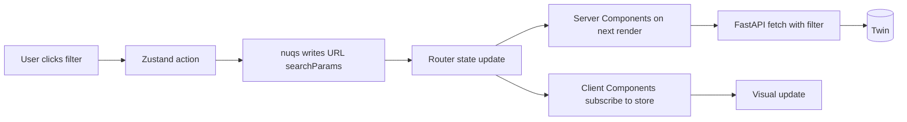

# Dashboard v2 — Filter State + URL Bookmarks Architecture

**Note:** Filter mechanics overlap with `06-interaction-patterns.md` (cross-filter state). This doc focuses on the unique deltas: concrete URL schema, cache invalidation under filter changes, saved-views tier-2, browser back/forward semantics, and edge cases.

## 1. Filter dimensions inventory

| Dimension | Tabs | Default | Valid options | Dependencies |
|---|---|---|---|---|
| **Date range** (`from` / `to`) | All | Last 7 days | ISO date strings; presets: 1d, 1w, 12w, 1m, 6m, 1y, custom | None |
| **Outcome** | Pulse, Conversion, Quality | (all) | `load_booked` / `no_match` / `carrier_not_qualified` / `call_abandoned`; multi-select | None |
| **Sentiment** | Pulse, Quality | (all) | `positive` / `neutral` / `negative`; multi-select | None |
| **MC number** | Carriers, Calls | None | string, ≤12 chars, alphanumeric | When set, locks date range to MC's history scope |
| **Origin state** | Lanes, Economics | (all) | 2-letter US state code | Pairs with destination_state |
| **Destination state** | Lanes, Economics | (all) | 2-letter US state code | Pairs with origin_state |
| **Equipment type** | Lanes, Carriers | (all) | reefer / dry-van / flatbed / power-only / other | None |
| **Free text** | Calls (transcript), Carriers (name) | None | URL-encoded string, max 64 chars | Server-side single-needle ILIKE |

Per-tab filter visibility: header shows date + global slicers; each tab adds its tab-specific dimensions (e.g., Lanes shows origin/destination/equipment, Quality omits them).

## 2. State architecture decision

**Recommendation: Zustand store + nuqs URL sync.**

Already deeply covered in `06-interaction-patterns.md` §4. Pattern:



Why not pure URL: hover state has no business in URL; verbose; per-keystroke writes pollute history.
Why not Context: every consumer rerenders on any change.
Why not Jotai: this app's filter is one cohesive object — Zustand "store with actions" is the closer fit.

## 3. URL schema design

### Canonical examples

```
/dashboard?from=2026-04-22&to=2026-04-29
/dashboard/calls?from=2026-04-22&to=2026-04-29&outcome=load_booked&q=148373
/dashboard/lanes?from=2026-04-22&to=2026-04-29&origin=TX&destination=CA&equipment=reefer
/dashboard/carriers/148373?from=2026-04-22&to=2026-04-29
/dashboard/economics?range=12w&compare=prev_period&lane=TX-CA-Reefer
```

### Encoding rules

| Type | Encoding | Example |
|---|---|---|
| Date | ISO-8601 date (no time) | `from=2026-04-22` |
| Date with time | ISO-8601 UTC | `from=2026-04-22T14:00:00Z` |
| Single enum | bare value | `outcome=load_booked` |
| Multi-enum | comma-separated | `outcome=load_booked,no_match` |
| String | URL-encoded | `q=Acme%20Logistics` |
| State code | uppercase 2-letter | `origin=TX` |
| MC number | bare alphanumeric | `mc=148373` |
| Compound (lane) | dash-separated | `lane=TX-CA-Reefer` |

### Convention for "absent filter"

**Omit the param entirely** rather than `outcome=` or `outcome=null`. Cleaner URLs, smaller history entries, easier `nuqs` parsers.

### Length budget

Browser URL limit ~2000 chars (IE legacy / nginx default). Worst case our v2 schema:
```
?from=2026-04-22T14:30:00Z&to=2026-04-29T18:45:00Z&outcome=load_booked,no_match,carrier_not_qualified&sentiment=positive,neutral&mc=148373&origin=TX&destination=CA&equipment=reefer&q=urgent%20delivery%20detroit&compare=prev_period
```
~280 chars. Safe by an order of magnitude.

### Validation strategy

Parse on every render with safe defaults; bad params **silently ignore**. Don't 404. Examples:
- `outcome=garbage` → null (treat as no filter)
- `from=NOT-A-DATE` → null (drop the param, default to last week)
- `mc=<script>alert(1)</script>` → fail regex `^[A-Za-z0-9]+$`, drop

## 4. Cross-filter semantics

Already covered in 06. Quick summary:
- Tab-level scope by default (date filter is page-level / global).
- Conflict: pie click overrides header where they collide.
- Visual: filter chips with × to clear individually; "Clear all" button.
- Reset: defaults restore last-7-days, all outcomes, no MC.

## 5. Cache invalidation under filter changes

This is the section that materially affects backend. Current FastAPI `TTLCache(maxsize=128, ttl=30)` wraps 9 aggregation functions. With v2 filters, cache key explodes:

### Cache key construction

```python
def _cache_key(fn_name: str, **filters) -> str:
    """Canonical filter-keyed cache key. Order-stable for hit rate."""
    parts = [fn_name]
    for k in sorted(filters):
        v = filters[k]
        if v is None:
            continue  # absent dimensions don't affect key
        if isinstance(v, list):
            v = ",".join(sorted(str(x) for x in v))
        parts.append(f"{k}={v}")
    return ":".join(parts)
```

Example keys:
- `funnel:from=2026-04-22:to=2026-04-29` (default view)
- `funnel:from=2026-04-22:outcome=load_booked:to=2026-04-29`
- `economics_rate_summary:from=2026-04-22:lane_origin=TX:to=2026-04-29`

### Cache size budget

7 active dimensions × 5 typical values each = 35^7 = explosion. Realistic constraint:
- Most users hit 3-5 canonical filters (today / last 7 days / last 30 days / by-outcome).
- Long-tail filters (custom MC, custom lane) are short-lived; LRU evicts.

Bump `maxsize` from 128 to **512**:
- Per entry ~5KB → 2.5MB heap. Trivial on Fly's 256MB tier.
- Hit rate stays ~70-90% on default views; ~30% on ad-hoc.

Add monitoring: `dashboard_cache_stats()` exposes hit/miss counters. If miss rate >70% sustained, narrow caching to canonical defaults only.

### Webhook invalidation strategy

Current: `invalidate_dashboard_cache()` clears ALL keys on any `call.ended` event. Acceptable in v1 (9 keys); wasteful in v2 (potentially hundreds of keyed entries).

**Tier-1.5 (still MVP):** keep full clear. Simplicity > efficiency at single-broker scale.

**Tier-2 (when we scale):** selective clear by MC + date overlap:

```python
def invalidate_dashboard_cache(*, mc: str | None = None, ts: datetime | None = None) -> None:
    if mc is None and ts is None:
        _dashboard_cache.clear()
        return
    keys_to_drop = []
    for k in _dashboard_cache:
        # MC filter on key
        if mc and f":mc={mc}" not in k and ":mc=" in k:
            continue  # this key is for a different MC; skip
        # Date overlap
        if ts and ":from=" in k and ":to=" in k:
            from_, to_ = _parse_dates_from_key(k)
            if not (from_ <= ts <= to_):
                continue
        keys_to_drop.append(k)
    for k in keys_to_drop:
        _dashboard_cache.pop(k, None)
```

Requires HR webhook to thread `mc_number` + `time` (already does). Implementation: ~30 min.

### Don't cache search

Free-text search results NOT cached. Keyspace explodes (every unique query string), and freshness expectations are highest on free-text (user often retypes refining searches).

## 6. Optimistic UI patterns

Covered in 06 §4.8 and 09 (polish). One-line summary: state update is immediate, fetch is `useTransition`-wrapped, race conditions handled via `AbortController` keyed by filter signature hash.

## 7. Server Component re-render strategy

Next.js 15 specifics:
- Server Components rerun on `searchParams` change (URL change triggers route render).
- Client Components don't trigger Server Component refetch unless they navigate.
- For cross-filter to work: major filters in URL (Server Components see them); slice-click "drill" filters in client store (no server fetch needed if data already loaded).

**Hybrid implementation:**
- Date range, outcome, sentiment, MC → URL via `nuqs` → Server Components fetch on render.
- Hovered ID, transient slice click → client-only Zustand → in-page filter on already-fetched data.
- Reload page → full state reproduces from URL ✓.

## 8. Drill-down vs drill-through state propagation

**Drill-down (in-place expand):**
- Updates client store only.
- Parent component stays mounted.
- URL unchanged.
- Example: clicking month bar → expands to weeks within same chart.

**Drill-through (navigate to detail page):**
- URL change triggers route navigation.
- All current filters serialize into the new URL.
- Breadcrumb at each level reads its slice of `searchParams`.
- Example: clicking carrier row → `/dashboard/carriers/[mc]?from=...&to=...`.

**Filter persistence rule:** when navigating drill-through, ALL applied filters carry forward to the detail page URL. User can clear them on the new page if irrelevant.

## 9. Persistence for "Saved Views"

**MVP:** URL state IS the bookmark. "Copy view" button → `navigator.clipboard.writeText(window.location.href)` + toast.

**Tier-2 (post-submission):** named views.

```typescript
// localStorage approach (zero backend cost)
type SavedView = { name: string; url: string; createdAt: string };
const savedViews: SavedView[] = JSON.parse(localStorage.getItem("dashboard:saved-views") ?? "[]");
```

UX: "Save view as…" button → name prompt → stored. Sidebar shows recent + saved views.

**Tier-3 (multi-tenant production):** `saved_views` Twin table with `(user_id, view_name, url_state, created_at)` — adds Twin write path. Defer until shared-views is requested.

## 10. Browser back/forward semantics

`nuqs` supports both `push` and `replace`:

| Action | Method | Why |
|---|---|---|
| Apply major filter (date range, outcome) | `push` | User wants back-button to undo |
| Slice click (drill within page) | `replace` | Avoid history pollution per click |
| Text search keystroke | `replace` | Debounced; only commit point pushes |
| Clear all filters | `push` | User wants to reach this state again |
| Bookmark / share URL | `push` (already a unique URL) | — |

Net behavior: user can hit "back" 5 times to undo 5 deliberate filter applications, but slice-clicking 20 times doesn't pollute history with 20 entries.

## 11. Edge cases

| Case | Handling |
|---|---|
| Empty result set after filter | Render "No data for these filters" + single "Clear filters" button |
| Invalid date range (from > to) | Swap automatically + warn toast: "Date range was inverted; swapped" |
| MC number with no calls | 404 page with "Try a different carrier" link + recent-MCs suggestion |
| Free-text injection (`<script>`) | Pydantic regex validation drops; client-side never echoes raw input back to UI |
| Filter values that don't match any data | Render gracefully — empty chart, "No matches" copy, no crash |
| Browser refresh | Full state reproduces from URL ✓ |
| Two browser tabs with different filters | Independent (each tab has its own URL) ✓ |
| Token rotation mid-session | 401 → toast "Session expired, refresh" + auto-redirect; out of scope for MVP |
| Slow network | Debounced filter changes (300ms) + `useTransition` keeps UI responsive |
| Very long URLs (>2000 chars) | Defensive truncation on the `nuqs` write path; warn toast |
| User pastes a future date | Pydantic clamp to "today" max; warn toast |
| User pastes an ancient date | If `from < 2000-01-01` → drop, default to last week |
| Concurrent filter changes (race) | `AbortController` cancels in-flight; latest wins |
| Filter combination caches but data expires before user clicks | `nuqs` parses URL → cache miss → fresh fetch transparently |

## Final summary

- **State architecture:** Zustand store + nuqs URL sync. Major filters in URL (Server Components fetch); transient drill state in client store.
- **Recommended libraries:** `zustand` (~3KB), `nuqs` (~5KB).
- **Top 3 risks:**
  1. Cache keyspace explosion at high cardinality (mitigated by `maxsize=512` + LRU + monitoring).
  2. Browser back-button pollution if every keystroke pushes history (mitigated by `replace` for keystrokes, `push` for commits).
  3. Tier-2 selective cache invalidation requires HR webhook to thread `mc_number` (already does; just implementation work).
- **Effort:** **M** for full filter state implementation (~3-4 hr Claude including all 7 dimensions, URL parsers, debounce, edge cases). **S** for the cache key refactor on the FastAPI side (~1 hr).
