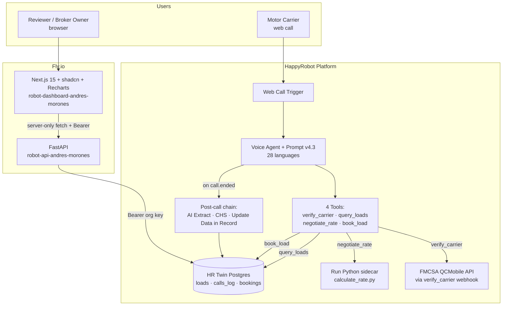
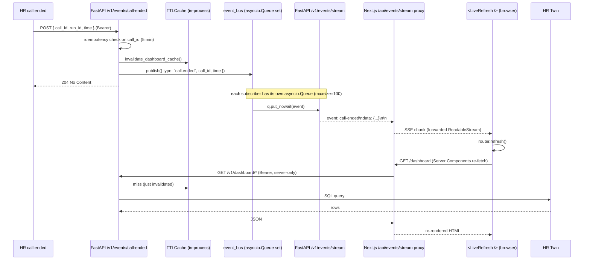

# Services Integration — Cross-Component Architecture

Single-doc reference for every service this take-home depends on, how the pieces talk to each other, and what happens when each one fails. Audience: a reviewer skimming for completeness, plus any future engineer who needs to onboard fast.

Companion docs:
- `docs/hr-architecture-map.md` — per-component HR config (workflow, nodes, tools, Twin tables)
- `docs/FDE-TECHNICAL-CHALLENGE.md` — original spec
- `README.md` — repo orientation
- ADRs: `docs/decisions/ADR-00{2..9}.md` (ADR-009 covers the webhook+SSE push pipeline)

Last updated: 2026-04-28 (Phase C — alongside Voice Agent v4.3, FastAPI expansion, dashboard caching).

---

## 1. System overview



The voice path is fully HR-native; FastAPI sits **outside** the call hot path. The dashboard path is the only place our own infrastructure handles user traffic.

---

## 2. Service inventory

| Service | Owner | Purpose | Depends on | Runtime |
|---|---|---|---|---|
| HappyRobot Voice Agent | HR | LLM-driven voice conversation orchestration | OpenAI / GPT-4.1 | HR cloud |
| Voice Agent Prompt v4.3 | us | system prompt for the Voice Agent | — | HR Voice Agent node |
| verify_carrier tool | us (config) | MC eligibility check | FMCSA QCMobile API | HR tool node (Predefined Webhook) |
| query_loads tool | us (config) | load search by lane / load_id | HR Twin loads table | HR tool node + Read-from-Twin child |
| negotiate_rate tool | us (config) | per-round floor calculation | calculate_rate.py | HR tool node + Run Python child |
| book_load tool | us (config) | persist booking mid-call | HR Twin bookings table | HR tool node + Write-to-Twin child |
| AI Extract (post-call) | us (config) | call_outcome + fmcsa_eligibility_failure_reason | call transcript | HR post-call node |
| Case Health Score (CHS) | us (config) | case_health_score + sentiment + audit_remarks | call transcript | HR post-call node |
| Update Data in Record | us (config) | write calls_log row | calls_log table | HR post-call node (Write-to-Twin) |
| HR Twin Postgres | HR | runtime persistence (loads · calls_log · bookings) | — | HR cloud |
| FMCSA QCMobile API | DOT | MC carrier registry | — | external |
| FastAPI backend | us | dashboard endpoints + loads endpoints | HR Twin REST | Fly.io (`robot-api-andres-morones`) |
| Next.js dashboard | us | KPI views + carrier drilldowns | FastAPI | Fly.io (`robot-dashboard-andres-morones`) |
| HTML legacy dashboard | us | server-rendered fallback view | FastAPI | Fly.io (same app as FastAPI, served at `/dashboard`) |
| TTLCache layer | us | reduces Twin query load by ~95% | cachetools | in-process FastAPI |
| ISR cache layer | us | rendered HTML cache (Next.js App Router) | `revalidate=30` | Next.js Server Components |

---

## 3. Per-service integration details

### HappyRobot Voice Agent
- **Inputs:** carrier audio stream from HR Web Call Trigger; prompt body v4.3; workflow vars (agent_name, company_name, negotiation_floor_pct, max_negotiation_rounds, Time.Now).
- **Outputs:** tool calls (4 tools), final transcript, call metadata (call_id, duration, from_number) consumed by the post-call chain.
- **Auth:** none externally — HR-managed.
- **Failure mode:** if the LLM provider is degraded, the agent falls back to scripted retries within HR; the carrier hears filler ("one moment"). A hard failure ends the call with no calls_log row written by the post-call chain.
- **Retry / idempotency:** prompt v4.3 includes "TRUST FIRST SUCCESS" rule for tool retries; book_load duplicates are blocked by the bookings UNIQUE constraint.

### verify_carrier (HR Predefined Webhook)
- **Inputs:** mc_number (string) from the carrier.
- **Outputs:** carrier registry payload — name, status, allowed-to-operate, insurance, authority.
- **Auth:** webKey query parameter (FMCSA-issued, provided in spec — see §8).
- **Failure mode:** FMCSA timeouts trigger a single retry per prompt v4.3 ("FMCSA's slow today" filler). On hard failure the agent runs the spec-literal "system trouble" script and ends the call gracefully.
- **Retry / idempotency:** safe to retry — purely read-only.

### query_loads (HR Tool → Read-from-Twin)
- **Inputs:** any subset of {load_id, origin_state, origin_city, destination_state, destination_city, equipment_type, pickup_window}.
- **Outputs:** array of load rows (capped at 25), sorted by `pickup_datetime ASC`.
- **Auth:** none — runs inside HR over the Twin's internal connection.
- **Failure mode:** Twin REST 5xx → tool failure → prompt's "search hiccup" recovery; agent can re-attempt with relaxed filters.
- **Retry / idempotency:** safe to retry — read-only.

### negotiate_rate (HR Tool → Run Python sidecar)
- **Inputs:** loadboard_rate (number), pickup_datetime (string); plus injected workflow var negotiation_floor_pct and Time.Now via @ picker.
- **Outputs:** final_floor, urgency_tier, hours_until_pickup, base_floor_pct, urgency_drop, final_floor_pct.
- **Auth:** none — sidecar runs inside HR's RestrictedPython sandbox.
- **Failure mode:** sandbox raises → tool failure → agent reverts to conservative floor (negotiation_floor_pct flat). Verified math test passed on 2026-04-28.
- **Retry / idempotency:** safe to retry — pure function.

### book_load (HR Tool → Write-to-Twin)
- **Inputs:** load_id, mc_number, apply_rate (all required).
- **Outputs:** insert ack from Twin; new bookings row.
- **Auth:** none — runs inside HR over the Twin's internal connection.
- **Failure mode:** UNIQUE(call_id, load_id) violation on duplicate → tool error returned to agent. Other Twin 5xx → tool error; prompt v4.3's TRUST FIRST SUCCESS rule prevents retry storms.
- **Retry / idempotency:** **NOT** safe to blindly retry — the UNIQUE constraint is the idempotency mechanism. Verified live (1 duplicate insert correctly rejected during E2E test 2026-04-28).

### AI Extract (post-call)
- **Inputs:** Voice Agent transcript.
- **Outputs:** strict JSON with call_outcome + fmcsa_eligibility_failure_reason.
- **Auth:** none — internal HR node.
- **Failure mode:** Extract fails or times out → calls_log row may write with NULL outcome columns (CallRecord model is fully nullable to absorb this).
- **Retry / idempotency:** post-call only; HR does not retry automatically. Tier-2 backfill via re-extract from transcript.

### Case Health Score (CHS)
- **Inputs:** Voice Agent transcript.
- **Outputs:** case_health_score (0–100), audit_remarks (string), sentiment (enum).
- **Failure mode + retry:** identical to AI Extract.

### Update Data in Record (Write-to-Twin → calls_log)
- **Inputs:** outputs from AI Extract + CHS + Voice Agent metadata.
- **Outputs:** new calls_log row (12 cols).
- **Auth:** none — internal HR node.
- **Failure mode:** Twin write fails → row missing. No retry. Duplicate writes blocked at the application layer (HR fires once per call.ended).
- **Retry / idempotency:** assumed single-write per call.ended event.

### HR Twin Postgres
- **Inputs:** REST queries (Read-from-Twin / Write-to-Twin children, plus FastAPI `twin_client`).
- **Outputs:** SQL result rows.
- **Auth:** Bearer `HAPPYROBOT_API_KEY` (org-scoped) for external clients (FastAPI). Internal HR connections are auth-free.
- **Failure mode:** Cloudflare WAF block on disallowed SQL patterns (IN-lists, multi-statement, JSONB ops) — surfaces as 4xx; mitigated in `twin_client` by single-statement + `:placeholder` interpolation. 5xx propagates to FastAPI 500 → Next.js error.tsx boundary.
- **Retry / idempotency:** reads safe to retry; writes idempotent only via UNIQUE constraints (bookings).

### FMCSA QCMobile API
- **Inputs:** MC number + webKey query param.
- **Outputs:** carrier registry payload (status, name, authority, insurance).
- **Auth:** webKey query param (from spec).
- **Failure mode:** flaky / slow during business hours; 5xx not unusual. Handled by single retry + graceful end-call.
- **Retry / idempotency:** read-only; safe.

### FastAPI backend
- **Inputs:** HTTP requests from Next.js Server Components and HR webhook tools (loads).
- **Outputs:** JSON responses for 12 endpoints (loads search/by-ref, calls list/by-id, carriers list/by-mc, dashboard funnel/economics/operational/quality/calls/loads, healthz, /dashboard HTML view) plus 3 push-pipeline endpoints (`POST /v1/events/call-ended`, `POST /v1/events/session`, `GET /v1/events/stream`).
- **Auth:** Bearer token via `Authorization`, `x-api-key`, or `?token=` (constant-time compare in `app/deps.py::require_api_key`). `/healthz`, `/docs`, and `/dashboard` are open.
- **Failure mode:** Twin 5xx → 500 Internal; FastAPI lifespan logs structured JSON. Fly healthcheck on /healthz catches hard outages.
- **Retry / idempotency:** all endpoints are GET (read-only) except the deprecated POST /v1/calls/log which returns 410 Gone.

### Next.js dashboard
- **Inputs:** browser HTTP requests; renders 4 dashboard pages (overview, calls, carriers, carrier drilldown).
- **Outputs:** rendered HTML/CSS/JS to the browser.
- **Auth:** browser → Next.js is currently public (Tier-2 hardening: SSO / basic auth). Next.js → FastAPI uses `API_BEARER_TOKEN` via `server-only` import (token never reaches the browser bundle).
- **Failure mode:** FastAPI 5xx → Next.js renders error.tsx error boundary per route segment.
- **Retry / idempotency:** ISR caches successful renders for 30s; transient errors don't poison the cache.

### HTML legacy dashboard (`/dashboard` on the API app)
- Retained per ADR-006 as a fallback / dev preview. Server-rendered Jinja-ish HTML. Will be retired once Next.js is verified live (Phase 7 polish).

---

## 4. Auth chain end-to-end

Five distinct trust boundaries, four distinct credentials:

| Hop | Credential | Where stored | Notes |
|---|---|---|---|
| Browser → Next.js | none | — | publicly accessible; Tier-2 hardening on roadmap |
| Next.js Server → FastAPI | `Authorization: Bearer ${API_BEARER_TOKEN}` | Fly secret on `robot-dashboard` + local `.env.local` | `server-only` import in `dashboard/src/lib/api-client.ts` — never reaches browser |
| FastAPI → HR Twin REST | `Authorization: Bearer ${HAPPYROBOT_API_KEY}` | Fly secret on `robot-api` + local `.env` | separate org-level key, distinct from API_BEARER_TOKEN |
| HR Voice Agent → HR Twin (in-workflow) | none (native) | — | Read-from-Twin / Write-to-Twin children run inside HR |
| HR Voice Agent → FMCSA | `?webKey=cdc33e44...` query param | baked into the verify_carrier webhook URL | provided in the FDE spec (memory `project_fmcsa_key_provided.md`) |
| HR Workflow → FastAPI (webhook) | `Authorization: Bearer ${API_BEARER_TOKEN}` | configured in HR Workflow → Webhooks → `call.ended` | inbound `POST /v1/events/call-ended` (ADR-009); ADR-005 dropped the legacy `POST /v1/calls/log` |

Constant-time compare in FastAPI's auth dep prevents timing-oracle leaks.

---

## 5. Data flow trace per call lifecycle

### Trace A — happy path booking call
1. Carrier dials web URL → HR Web Call Trigger fires.
2. Voice Agent greets ("Thank you for calling Acme Logistics, this is Paul...") → captures MC.
3. **verify_carrier** → FMCSA QCMobile → 7-check passes.
4. **query_loads** → HR Twin loads → returns matching loads (sorted by pickup ASC, capped at 25).
5. Agent pitches; carrier counters.
6. **negotiate_rate** → calculate_rate.py → returns final_floor + urgency_tier.
7. Agent counters within floor; carrier accepts.
8. **book_load** → Twin bookings INSERT (UNIQUE catches retries).
9. Agent recap → sales-rep handoff line (v4.3) → spec-literal wrap-up.
10. Call ends → AI Extract + CHS run → **Update Data in Record** writes calls_log row.
11. Reviewer opens dashboard → Next.js Server Component (cache miss) → FastAPI (cache miss) → Twin → renders KPIs.

### Trace B — FMCSA decline
1-3. As Trace A.
4. verify_carrier returns inactive / not allowed.
5. Agent runs decline script (per failure-mode block in v4.3) → ends call gracefully.
6. AI Extract sets `fmcsa_eligibility_failure_reason`; CHS scores high (no agent failure).
7. Update Data in Record writes calls_log row with no booking. No bookings rows for this call_id.

### Trace C — abandoned call
1. Carrier dials, hangs up before substantive interaction (e.g. inside greeting).
2. AI Extract sets `call_outcome = call_abandoned`.
3. CHS deducts (low score, reflecting failed conversation — not agent fault but call surface lost).
4. Update Data in Record writes calls_log row with NULL booking-related fields.

---

## 6. Caching architecture

Three layers in production (ADR-009 promoted Layer 3 from deferred to shipped):

- **Layer 1 — Next.js ISR (`export const revalidate = 300`).** Applied to all 4 dashboard pages. Cached rendered HTML at the Next.js edge for 5 minutes; cache hits do **zero** work below the Next.js layer. The interval lengthened from 30s → 5 min when Layer 3 (push) shipped — webhooks now drive freshness, ISR is the safety net.
- **Layer 2 — FastAPI TTLCache (cachetools, `ttl=30s, maxsize=128`).** Wraps 9 aggregation functions in `api/app/services/dashboard_aggregations.py`. Sub-millisecond hits absorb Next.js misses. Per-key `asyncio.Lock` prevents cache stampedes on cold starts.
- **Layer 3 — Webhook + SSE push pipeline (Option C, ADR-009).** HR `call.ended` webhook → FastAPI `POST /v1/events/call-ended` (Bearer, idempotent on `call_id`) → `invalidate_dashboard_cache()` + `event_bus.publish()` → SSE subscribers fan out → browsers `router.refresh()`. Sub-second freshness on the happy path; the 5-min ISR catches any dropped webhook.

Combined steady-state effect: ~95-99% reduction in Twin query load vs the pre-cache baseline; staleness ceiling drops from 30s polling to ~1-3s push (with 5-min worst case if a webhook drops). See **ADR-007** (cache layers) + **ADR-009** (push pipeline) for full tradeoffs.

### Push pipeline sequence



### Cache invalidation chain

The single `invalidate_dashboard_cache()` call clears all 9 wrapped TTL entries atomically. This is the seam ADR-007 reserved and ADR-009 wires up. Anything else that needs to invalidate (e.g. a future booking-only webhook, or a manual admin endpoint) calls the same helper — no per-call-site cache keys to remember.

---

## 6.5. Cloudflare WAF — third-party security layer in front of HR Twin

HappyRobot puts a **Cloudflare WAF (Web Application Firewall)** in front of `platform.happyrobot.ai/api/v2/twin/sql`. This is HR's infrastructure, not ours; we don't configure or own it. It enforces a generic SQL-injection protection ruleset on every body that hits the SQL endpoint, regardless of the org-level Bearer key.

### What the WAF blocks (and why)

The Cloudflare-managed ruleset is OWASP-aligned and defends against generic SQL-injection / SQL-extraction patterns. It is **content-based** — it inspects the SQL string itself for shapes that look hostile, even when the caller is authenticated. We hit a handful of false positives because some legitimate analytics SQL shapes look superficially like data-extraction attempts.

| Pattern | Why the WAF flags it |
|---|---|
| `information_schema.*` queries | Classic database-introspection / fingerprinting step in a SQL injection chain |
| `ORDER BY <col> LIMIT <n>` (esp. with `OFFSET`) | Pagination-based blind extraction (incrementing OFFSET to dump rows) |
| Multi-aggregate SELECT (`SELECT AVG(a), SUM(b), COUNT(*) FROM t`) | "Stack many computed values in one query" looks like a UNION-style extraction probe |
| `IN (...)` lists with literals | Common payload shape: `WHERE id IN (1,2,3 UNION SELECT password FROM users)` |
| `UNION ALL` / `UNION SELECT` | Injection primitive |
| Quoted JSONB / `::cast` operators in unusual places | Postgres-specific injection vectors |
| Bodies with embedded `';--` / encoded payload markers | Unambiguous injection signatures |

The block is returned as a **403 with a Cloudflare HTML error page** (not a JSON body). Our `twin_client` surfaces it as `HTTPException(400, "Twin SQL error (403): <html>...")`.

### When WAF triggers, what we see

Symptom on the dashboard:
```
API 400: {"detail":"Twin SQL error (403): <!DOCTYPE html><!--[if lt IE 7]>...
```
Symptom in FastAPI structlog:
```
twin.sql_error  status=403  body=<HTML preview, first 500 chars>
```

The `body` preview is enough to identify a Cloudflare block (HTML challenge page) vs an actual SQL syntax error (returns JSON).

### Our defensive posture (this codebase)

Because we cannot tune Cloudflare's rules, we adapt every Twin SQL string to fall well inside the safe zone:

1. **Single-statement only** — no compound statements
2. **No `:placeholder` parameter binding** — Twin's REST gateway doesn't honor it; we do safe quoted-literal interpolation in `twin_client._sql_literal()` with a strict type whitelist (`str` / `int` / `float` / `bool` / `None`)
3. **No multi-aggregate SELECTs** — `economics_rate_summary`, `operational_summary`, `chs_distribution_sql`, `revenue_booked`, `bookings_per_booked_call` all pull raw rows + aggregate in Python. Twin payload stays tiny (one-row-per-call demo dataset)
4. **No `ORDER BY ... LIMIT`** — `audit_remarks` sample, `list_calls`, `list_carriers` sort + slice in Python instead
5. **No `IN (...)` lists** — use `LEFT JOIN ... IS NULL` or `NOT EXISTS` for set-difference
6. **No `information_schema`** — we use seed DDL files in `data/twin_schema_*.sql` for schema introspection; runtime never inspects schema
7. **GROUP BY simple aggregates remain fine** — `outcome_distribution` (`SELECT col, COUNT(*) GROUP BY col`) is allowed and used

### Why this isn't a hack — it's a security feature

Cloudflare's WAF in front of Twin **protects every HR customer from SQL injection in their voice-agent extensions**. Same protection applies whether the caller is malicious or authenticated; the auth boundary is HR's Bearer key but the input-validation boundary is the WAF rules. This is defense-in-depth: even if our org Bearer leaked, an attacker can't run `' UNION SELECT * FROM auth_tokens WHERE 1=1 --` because Cloudflare strips it before Twin ever sees it.

The architectural takeaway: **the dashboard's SQL is more constrained than typical Postgres apps because it's running through a WAF-protected gateway.** That's a feature, not a limitation. The trade is more Python-side aggregation in exchange for never being a SQL-injection blast radius.

### Tier-2 — when WAF gets in the way at scale

For dashboards with 10k+ rows where Python aggregation becomes wasteful, the standard escape is a **dedicated read replica** (Postgres Foreign Data Wrapper, materialized view, or a scheduled ETL into a non-WAF'd analytics DB). Documented in `master plan §scalability`. Not in MVP scope.

### Where this is implemented

- `api/app/services/twin_client.py` — REST gateway client; raises 502 on WAF body, 400 with HTML preview on auth-side rejection
- `api/app/services/dashboard_aggregations.py` — every SQL string includes a docstring noting WAF-safe constraints
- `api/app/services/calls_store.py` + `api/app/routers/carriers.py` — same pattern for the calls + carrier paths

---

## 7. Failure modes + circuit-breakers

| Failure | Detection | Behavior |
|---|---|---|
| Twin REST 5xx (read) | FastAPI 500 | Next.js renders `error.tsx` route-segment boundary. Retry on next `revalidate` window. |
| Twin REST 5xx (write — calls_log) | HR post-call chain logs; row missing | No retry; row never lands. Tier-2: re-extract pipeline. |
| Twin UNIQUE conflict (bookings) | `book_load` returns tool error | Prompt v4.3 TRUST FIRST SUCCESS rule prevents retry loop; agent moves on. |
| FMCSA timeout / 5xx | webhook tool error | Single retry with filler ("FMCSA's slow today"); on second failure, agent runs decline script and ends gracefully. |
| Cloudflare WAF block on Twin SQL | 4xx with HTML body | `twin_client` enforces single-statement + `:placeholder` interpolation to avoid known triggers. |
| HR LLM provider degraded | call drops or stalls | HR-internal failover; if it lands, no calls_log row writes. |
| HR `call.ended` webhook drops | client never sees push | 5-min Next.js ISR fallback re-fetches and surfaces missed call within one revalidate window (ADR-009 dual-source pattern). |
| SSE subscriber queue full (slow client) | `event_bus.publish` logs + drops event for that subscriber | Other subscribers still get fan-out; 5-min ISR catches the drop on the slow tab. |
| FastAPI hard outage | Fly healthcheck red on `/healthz` | Fly restarts the machine; Next.js shows error.tsx until /healthz green. |
| Next.js hard outage | browser-level | Reviewer falls back to HTML view at `https://robot-api-andres-morones.fly.dev/dashboard`. |

---

## 8. Environment variables + secrets

| Variable | Where it lives | Purpose |
|---|---|---|
| `API_BEARER_TOKEN` | Fly secret on `robot-api` AND `robot-dashboard`; local `.env` in `api/` + `.env.local` in `dashboard/` | Bearer auth between dashboard ↔ FastAPI. **Must match across both apps.** |
| `HAPPYROBOT_API_KEY` | Fly secret on `robot-api`; local `.env` in `api/`; shell env for `.mcp.json` | FastAPI → HR Twin REST + HR MCP server |
| `FMCSA_WEB_KEY` | provided in spec (`cdc33e44...`); baked into HR verify_carrier webhook URL; also in api/.env for any future server-side usage | FMCSA QCMobile auth |
| `API_BASE_URL` | Fly secret on `robot-dashboard`; local `.env.local` in `dashboard/` | Dashboard target API URL (`https://robot-api-andres-morones.fly.dev`) |
| `LOADS_CSV_PATH` | env var in `fly.toml` (`/app/loads.csv`) | path to bundled CSV inside the API image |
| `HR_BASE_URL` | env var in `fly.toml` (`https://platform.happyrobot.ai/api/v2`) | HR Twin REST root |
| `LOG_LEVEL` | env var in `fly.toml` (`INFO`) | structlog filtering level |

No secrets are committed to the repo. `.env.example` files in `api/` and `dashboard/` document the required vars.

---

## 9. Tier-2 roadmap (highest-value items)

Cross-ref: memory `project_hr_review_later_inventory.md` (35 items), ADR-005, ADR-006, ADR-007. Top items by ROI:

1. ~~HR `call.ended` webhook → cache invalidation~~ — **shipped 2026-04-28 per ADR-009.** SSE push + 5-min ISR fallback live.
2. **Custom evals + adversarial activation** — HR-native eval suite for the voice agent; covers prompt injection, FMCSA edge cases, multi-load lane variants.
3. **`load_booked_status` field on loads table** — currently inferred from bookings join; making it explicit simplifies dashboard SQL and supports a "loads remaining" KPI.
4. ~~Real-time webhook + SSE push to dashboard~~ — **shipped 2026-04-28 per ADR-009** as the same upgrade as item 1.
5. **Multi-region Fly + Redis cache** — when scaling beyond `min_machines=1`, in-process TTLCache breaks cross-machine consistency. Redis is the documented escape hatch.
6. **GitHub Actions CI/CD** — currently `fly deploy` is manual; CI brings reproducible deploys + test gating.
7. **FMCSA webKey to Fly secret** — F11 hardening; replaces the plaintext URL with a server-side proxy.

---

## 10. Spec compliance trace

Cross-reference: `docs/FDE-TECHNICAL-CHALLENGE.md`. This table maps spec clauses to the integration boundary that satisfies them.

| Spec clause | Service / boundary that satisfies it |
|---|---|
| Inbound carrier picks up via web call | HR Web Call Trigger → Voice Agent |
| Verify MC against FMCSA | verify_carrier tool → FMCSA QCMobile API |
| Search loads matching carrier needs | query_loads tool → HR Twin loads table |
| Pitch + negotiate up to 3 rounds | Voice Agent Prompt v4.3 + negotiate_rate tool + calculate_rate.py sidecar |
| Mock transfer to sales rep | Transfer Popup + v4.3 sales-rep handoff script (Beat 2 in MOCK TRANSFER WORDING block) |
| Log call data | AI Extract + CHS + Update Data in Record → calls_log; book_load → bookings |
| Classify call outcome + sentiment | AI Extract (call_outcome) + CHS (sentiment) |
| Custom dashboard surfacing call funnel + economics + operational + quality metrics | Next.js 15 dashboard at `dashboard/` consuming `/v1/dashboard/*` from FastAPI; HTML fallback at `/dashboard` |
| Containerized + HTTPS + Bearer auth | Fly.io (Let's Encrypt) for both apps; `app/deps.py::require_api_key` constant-time Bearer check |
| Deployment to a cloud provider | Fly.io: `robot-api-andres-morones` + `robot-dashboard-andres-morones` |
| API key auth on HTTPS endpoints | Bearer token via Authorization / x-api-key / ?token= query fallback |

End of doc.
